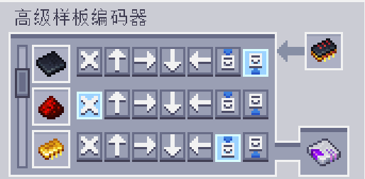

---
navigation:
  parent: aae_intro/aae_intro-index.md
  title: 高级样板编码器
  icon: advanced_ae:adv_pattern_encoder
categories:
- advanced items
item_ids:
- advanced_ae:adv_pattern_encoder
- advanced_ae:adv_processing_pattern
---

# 高级样板编码器

为了让 ME高级扩展样板供应器知道该把物品发送到哪里，需要一种特殊装置来编码这些
信息。手持它右键点击即可打开其 GUI。

<ItemImage id="advanced_ae:adv_pattern_encoder" scale="4"></ItemImage>

编码后的处理样板可以插入左侧槽位，随后会被解码，所有原材料将
以列表形式显示出来。

每一行都包含一组按钮，用来表示该材料可被发送到的所有可能方块面。
如果将选择保留在 “A” 按钮上，它会被发送到与样板供应器直接连接的那一面；而如果选择某个特定面，则会强制物品插入到该面。
需要注意的是，高级样板只能由 <ItemLink id="advanced_ae:adv_pattern_provider" /> 正确解析，
如果在其他类型的样板供应器中使用，则会像普通样板一样运作。
此外，如果单个物品无法插入到指定的面中，则不会按方向插入任何物品，而是会应用标准的样板供应器行为。