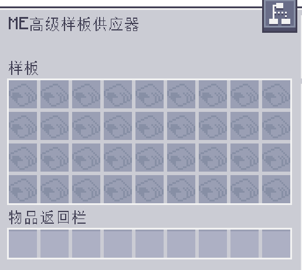

---
navigation:
  parent: aae_intro/aae_intro-index.md
  title: ME高级样板供应器
  icon: advanced_ae:adv_pattern_provider
categories:
- advanced devices
item_ids:
- advanced_ae:adv_pattern_provider
- advanced_ae:small_adv_pattern_provider
- advanced_ae:adv_pattern_provider_part
- advanced_ae:small_adv_pattern_provider_part
---

# ME高级扩展样板供应器

<Row gap="20">
<BlockImage id="advanced_ae:adv_pattern_provider" scale="8"></BlockImage>
<BlockImage id="advanced_ae:adv_pattern_provider" p:push_direction="up" scale="8"></BlockImage>
<GameScene zoom="8" background="transparent">
  <ImportStructure src="../structure/cable_app_part.snbt"></ImportStructure>
</GameScene>
</Row>

ME高级扩展样板供应器是一种新型的 <ItemLink id="ae2:pattern_provider" />，可将
标准版本或 <ItemLink id="extendedae:ex_pattern_provider" /> 升级为能够配置样板中每个独立物品应推送到
哪个面的版本。这一强大扩展使得那些
需要从特定侧面输入特定材料的机器，也能只用一个方块且无需管道实现自动化！

*我说的就是你，Mekanism。*

要使用此功能，你需要插入一个 <ItemLink id="advanced_ae:adv_processing_pattern" />。其制作方式是将一个已编码样板放入 <ItemLink id="advanced_ae:adv_pattern_encoder" /> 中，然后取出其高级版本。

还有一个扩展版本，单个样板供应器最多可容纳 36 个样板。

