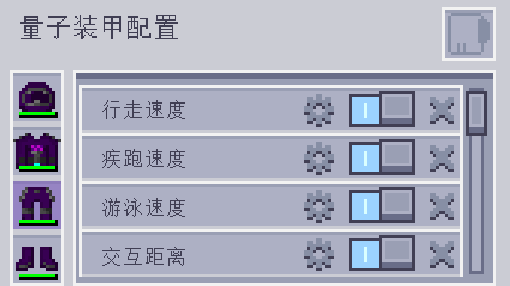

---
navigation:
  parent: aae_intro/aae_intro-index.md
  title: 量子盔甲套装
  icon: advanced_ae:quantum_helmet
categories:
- advanced items
item_ids:
- advanced_ae:quantum_helmet
- advanced_ae:quantum_chestplate
- advanced_ae:quantum_leggings
- advanced_ae:quantum_boots
- advanced_ae:quantum_upgrade_base
- advanced_ae:walk_speed_card
- advanced_ae:sprint_speed_card
- advanced_ae:step_assist_card
- advanced_ae:jump_height_card
- advanced_ae:lava_immunity_card
- advanced_ae:flight_card
- advanced_ae:water_breathing_card
- advanced_ae:auto_feeding_card
- advanced_ae:auto_stock_card
- advanced_ae:magnet_card
- advanced_ae:hp_buffer_card
- advanced_ae:evasion_card
- advanced_ae:regeneration_card
- advanced_ae:strength_card
- advanced_ae:attack_speed_card
- advanced_ae:luck_card
- advanced_ae:reach_card
- advanced_ae:swim_speed_card
- advanced_ae:night_vision_card
- advanced_ae:flight_drift_card
- advanced_ae:recharging_card
- advanced_ae:portable_workbench_card
- advanced_ae:pick_craft_card
---

# 量子盔甲套装

<Row gap="10">
<ItemImage id="advanced_ae:quantum_helmet" components="ae2:stored_energy=2.0E8d" scale="4"></ItemImage>
<ItemImage id="advanced_ae:quantum_chestplate" components="ae2:stored_energy=3.0E8d" scale="4"></ItemImage>
<ItemImage id="advanced_ae:quantum_leggings" components="ae2:stored_energy=2.5E8d" scale="4"></ItemImage>
<ItemImage id="advanced_ae:quantum_boots" components="ae2:stored_energy=2.0E8d" scale="4"></ItemImage>
</Row>

<ItemGrid>
<ItemIcon id="advanced_ae:quantum_helmet" components="ae2:stored_energy=2.0E8d"></ItemIcon>
<ItemIcon id="advanced_ae:quantum_chestplate" components="ae2:stored_energy=3.0E8d"></ItemIcon>
<ItemIcon id="advanced_ae:quantum_leggings" components="ae2:stored_energy=2.5E8d"></ItemIcon>
<ItemIcon id="advanced_ae:quantum_boots" components="ae2:stored_energy=2.0E8d"></ItemIcon>
</ItemGrid>

你是否曾想过，把你的 AE 系统穿在身上会是什么感觉？现在你不用再猜了。量子盔甲套装是一套高度科技化、兼具隐蔽性的装备，能够连接到 AE2 系统，让你随时随地方便地取用一切物品！默认情况下，它是一套由能量驱动的护甲，防御能力可与下界合金装备媲美。它还能利用自身的缓冲能量生成能量盾，提供相当可观的伤害吸收。靴子还可免疫摔落伤害，而胸甲则能移除飞行时的挖掘速度惩罚。不过，这套护甲真正的力量，只有在你为其装满升级后才会彻底解锁！

 

## 连接护甲

这些护甲部件可以通过插入到 <ItemLink id="ae2:wireless_access_point" /> 的相应槽位中，
分别链接到系统。根据装备部件以及已安装的升级
卡，会解锁不同的特性。后面会详细介绍。请注意，要让这些额外功能正常工作，你还必须处于
已连接接入点的范围内。

 

## 安装升级

要安装升级，你需要先装备对应部件，然后按下快捷键（默认为 N）
打开量子装甲配置菜单。

在这个界面中，你可以添加/移除升级，也可以将它们切换为开启/关闭状态，并配置那些带有设置项的
升级。

 

## 量子升级基础卡

<ItemImage id="advanced_ae:quantum_upgrade_base" scale="2"></ItemImage>

<ItemLink id="advanced_ae:quantum_upgrade_base" /> 本身没有任何特殊作用，但它可用作
所有升级卡的合成材料。

 

## 自动饲育卡

<ItemImage id="advanced_ae:auto_feeding_card" scale="2"></ItemImage>

<ItemLink id="advanced_ae:auto_feeding_card" /> 可让你选择用于给
玩家进食的特定物品。只需将所需物品拖入筛选槽位中，如果该装备已连接到 AE2 网络，它就会在玩家饥饿时尝试
从系统中找到这些物品并喂给玩家。

 

## 自动补货卡

<ItemImage id="advanced_ae:auto_stock_card" scale="2"></ItemImage>

<ItemLink id="advanced_ae:auto_stock_card" /> 同样要求该装备部件已连接到 AE2 系统，
并且位于接入点的有效范围内。它可以配置若干组物品，使其在用户物品栏中始终维持特定数量。
这些槽位并不限于一组，因此如果你愿意，也可以将其设置为始终在物品栏中保持超过一格的数量。

 

## 速度卡

<Row gap="10">
<ItemImage id="advanced_ae:walk_speed_card" scale="2"></ItemImage>
<ItemImage id="advanced_ae:sprint_speed_card" scale="2"></ItemImage>
<ItemImage id="advanced_ae:swim_speed_card" scale="2"></ItemImage>
</Row>

* <ItemLink id="advanced_ae:walk_speed_card" />
* <ItemLink id="advanced_ae:sprint_speed_card" />
* <ItemLink id="advanced_ae:swim_speed_card" />

这些升级卡可以提升佩戴者的移动速度。它们都可以配置你想要的移动速度，
并且也会影响潜行和飞行时的移动。需要注意的是，这些升级同样可以用来
降低速度，以便在已经存在其他加速效果时获得更好的控制。

 

## 高度卡

<Row gap="10">
<ItemImage id="advanced_ae:jump_height_card" scale="2"></ItemImage>
<ItemImage id="advanced_ae:step_assist_card" scale="2"></ItemImage>
</Row>

* <ItemLink id="advanced_ae:jump_height_card" />
* <ItemLink id="advanced_ae:step_assist_card" />

这些升级会改变垂直移动方式，允许你配置更高的跳跃高度或自动跨步辅助。

 

## 飞行卡

<Row gap="10">
<ItemImage id="advanced_ae:flight_card" scale="2"></ItemImage>
<ItemImage id="advanced_ae:flight_drift_card" scale="2"></ItemImage>
</Row>

### 飞行卡

安装后，<ItemLink id="advanced_ae:flight_card" /> 可启用创造飞行。飞行速度可以通过
UI 中的滑块进行配置。它还会叠加受到步行/疾跑速度升级的影响。

### 飞行惯性卡

<ItemLink id="advanced_ae:flight_drift_card" /> 只有在安装了飞行卡时才会生效，它会额外添加一个
配置滑块，用于调整影响创造飞行的惯性。数值越低，你停下来的速度越快；当该值设为 0 时，
会瞬间停止。

 

## ME无线充能卡

<ItemImage id="advanced_ae:recharging_card" scale="2"></ItemImage>

<ItemLink id="advanced_ae:recharging_card" /> 可为所装备的部件启用无线充能。这要求它已
连接到网络，并且位于接入点范围内。若将此升级安装在胸甲上，还有一个额外好处：
它也会为物品栏槽位充能。

 

## 便携式元件工作台卡

<ItemImage id="advanced_ae:portable_workbench_card" scale="2"></ItemImage>

<ItemLink id="advanced_ae:portable_workbench_card" /> 为量子套装添加了一个便携式存储元件工作台。要打开
它，你需要按下已配置的快捷键。它的工作方式与方块形式相同。

 

## 点选合成卡

<ItemImage id="advanced_ae:pick_craft_card" scale="2"></ItemImage>

<ItemLink id="advanced_ae:pick_craft_card" /> 为这套盔甲新增了一个热键功能。按下后会尝试
合成玩家当前瞄准的方块。该功能要求存在与网络终端的链接，并且有一个
与目标匹配的样板。随后会弹出一个窗口要求输入所需数量，其处理流程与普通的
自动合成请求完全相同。

 

## 实用卡

<Row gap="10">
<ItemImage id="advanced_ae:night_vision_card" scale="2"></ItemImage>
<ItemImage id="advanced_ae:lava_immunity_card" scale="2"></ItemImage>
<ItemImage id="advanced_ae:water_breathing_card" scale="2"></ItemImage>
<ItemImage id="advanced_ae:magnet_card" scale="2"></ItemImage>
<ItemImage id="advanced_ae:camo_card" scale="2"></ItemImage>
</Row>

* <ItemLink id="advanced_ae:night_vision_card" />
* <ItemLink id="advanced_ae:lava_immunity_card" />
* <ItemLink id="advanced_ae:water_breathing_card" />
* <ItemLink id="advanced_ae:magnet_card" />
* <ItemLink id="advanced_ae:camo_card" />

这些卡片会为套装穿戴者提供多种实用效果，使其免疫某些类型的伤害并获得
夜视效果。其中，磁铁卡尤其特别，它带有一个配置界面，你可以在其中设置要拾取或不拾取的物品过滤器，
并配置其作用范围。

 

## 防御卡

<Row gap="10">
<ItemImage id="advanced_ae:hp_buffer_card" scale="2"></ItemImage>
<ItemImage id="advanced_ae:regeneration_card" scale="2"></ItemImage>
<ItemImage id="advanced_ae:evasion_card" scale="2"></ItemImage>
</Row>

* <ItemLink id="advanced_ae:hp_buffer_card" />
* <ItemLink id="advanced_ae:regeneration_card" />
* <ItemLink id="advanced_ae:evasion_card" />

这些升级会以多种形式为套装穿戴者提供防御方面的增益。生命值卡会提升最大
生命值，而再生卡会提高生命恢复速度。闪避卡则有概率使你对任意伤害来源完全
免疫。

 

## 攻击卡

<Row gap="10">
<ItemImage id="advanced_ae:strength_card" scale="2"></ItemImage>
<ItemImage id="advanced_ae:attack_speed_card" scale="2"></ItemImage>
</Row>

* <ItemLink id="advanced_ae:strength_card" />
* <ItemLink id="advanced_ae:attack_speed_card" />

这些升级会提升穿戴者的进攻能力，提供攻击伤害和攻击速度加成。

 

## 属性卡

<Row gap="10">
<ItemImage id="advanced_ae:luck_card" scale="2"></ItemImage>
<ItemImage id="advanced_ae:reach_card" scale="2"></ItemImage>
</Row>

* <ItemLink id="advanced_ae:luck_card" />
* <ItemLink id="advanced_ae:reach_card" />

这些升级卡会为穿戴者提供固定属性加成，影响幸运值以获得更好的掉落结果，并增加方块触及
距离。触及卡可以配置为你想要的具体数值。

 

## 更多内容即将到来

这套设备已作为基础内容发布，后续还计划推出大量其他功能，敬请期待！