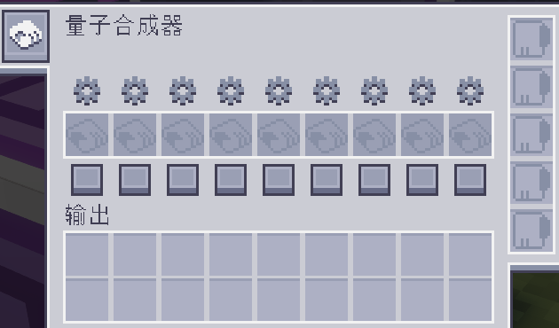
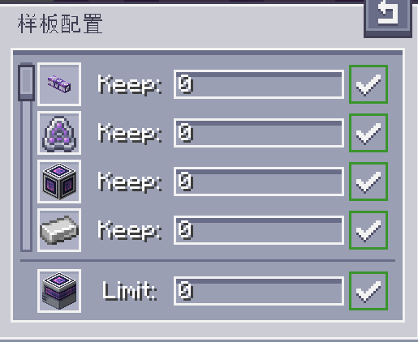

---
navigation:
  parent: aae_intro/aae_intro-index.md
  title: 量子合成器
  icon: advanced_ae:quantum_crafter
categories:
- advanced devices
item_ids:
- advanced_ae:quantum_crafter
---

# 量子合成器

<BlockImage id="advanced_ae:quantum_crafter" p:working="true" scale="4"></BlockImage>

量子合成器是一种强大且可配置的自动合成器。它能够调用整个 AE 系统的库存，
因此持续不断地合成也变得轻而易举。它可以高速运行合成任务，同时确保
你不会耗尽关键资源。它还支持流体替换合成以及
递归合成，即输入同时也是输出的合成。

## 使用合成器

要使用量子合成器，你需要将其放入网络并用线缆连接。运行需要
占用一个频道。选择你希望无限期执行的配方，并将它们编码进合成样板中。
这些样板可以插入到合成器对应的槽位中。

插入后，会有两个按钮可用于配置每个样板。底部的方形按钮
负责启用/禁用样板。被禁用的样板永远不会被合成，而启用的样板仍会遵循
一组条件。要设置这些条件，你需要点击齿轮按钮来打开模式配置 UI。

在样板配置界面中，所有材料和主输出都会列出。你可以使用数字输入框来调节你希望始终保留在 ME 系统中的每种材料数量，同时也可以为最终产物设置一个最大数量，以避免过度合成昂贵物品。输入所需数字后（也支持数学表达式），你需要按下 Enter 来应用输入。右侧会有提示，明确显示这些数值是否已成功应用。尤其是在配置输出上限时，如果该数值设为 0，则会移除限制，合成将持续进行，直到输入材料耗尽。

## 输出

量子合成器执行合成后的输出具有很高的可配置性。默认配置会尝试将物品直接从输出槽推送到 ME系统。通过左键点击左侧工具栏上的单元按钮，
可以改为将输出推送到邻近的容器中。启用此设置后，点击随后出现的另一个按钮，还可以进一步进行配置，以选择哪些面会被视为启用了
自动输出。这两项配置的组合应当能提供充足的控制空间与创造性选择，让你能够决定如何使用这台合成器。

## 升级

要完全发挥量子合成器的潜力，就必须安装升级卡。它可以接收
<ItemLink id="ae2:speed_card" /> 和 <ItemLink id="ae2:redstone_card" />。前者能大幅提升合成
速度，最高可达到每 tick 对每种样板合成 64 次，而后者则允许进行红石控制。