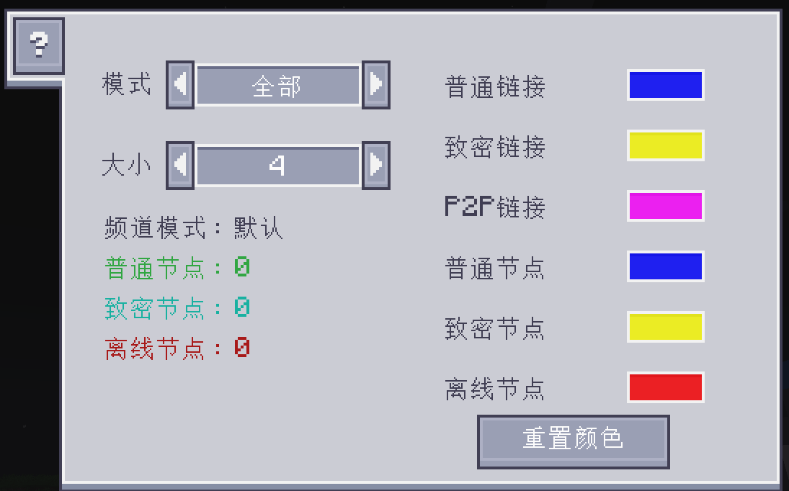

---
navigation:
  parent: ae2:items-blocks-machines/items-blocks-machines-index.md
  icon: ae2netanalyser:network_analyser
  title: ME网络分析仪
categories:
- tools
item_ids:
- ae2netanalyser:network_analyser
---

# 分析 ME 网络

<ItemImage id="ae2netanalyser:network_analyser" scale="4"></ItemImage>

你是否曾苦于找不出 ME 网络中哪台设备离线了？或者只是想看看你的网络
运行状况如何？这就是 ME网络分析仪！

## 我的 ME 网络到底发生了什么？

点击任意连接到 ME 网络的方块、线缆或设备，你就能看到每个设备的状态以及它们彼此之间是如何连接的。

不同的颜色和形状代表不同状态。
- 蓝色立方体：普通 ME 设备，它们有足够频道，并且可传输 8 个频道。
- 黄色立方体：致密 ME 设备，它们有足够频道，并且可传输 32 个频道。
- 红色立方体：离线的 ME 设备，它们没有足够频道。
- 蓝色连线：该连线最多可承载 8 个频道。
- 黄色连线：该连线最多可承载 32 个频道。
- 粉色连线：这是一个 ME P2P 连线。
- 数字：该连线当前承载的频道数量。

请注意，最大频道数实际上取决于你的 ME 频道模式。当
无限频道模式开启时，分析器不会显示频道编号。

## 自定义显示

你可以在配置 GUI 中更改分析模式和颜色。

ME网络分析器有 5 种模式。
- 完整：显示所有网络状态。
- 节点：只显示节点状态。
- 连接：只显示连接状态。
- 无数字：不显示频道编号。
- P2P：只显示 ME P2P 连接。

你还可以更改节点或连接的颜色。

