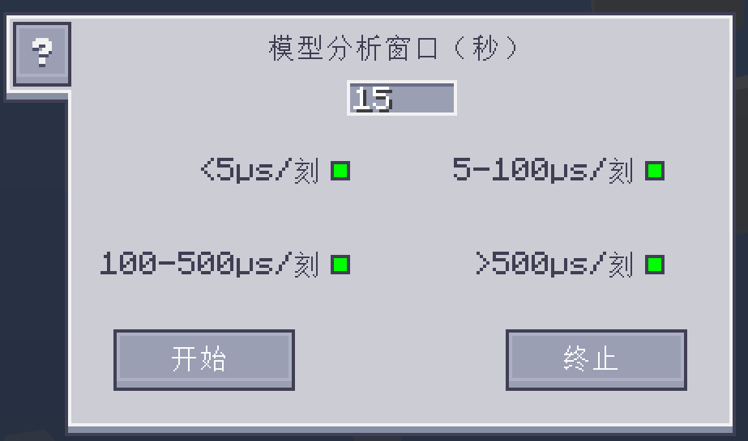

---
navigation:
  parent: ae2:items-blocks-machines/items-blocks-machines-index.md
  icon: ae2netanalyser:tick_analyser
  title: ME刻速率分析仪
categories:
- tools
item_ids:
- ae2netanalyser:tick_analyser
---

# 分析 ME Tick 速率

<ItemImage id="ae2netanalyser:tick_analyser" scale="4"></ItemImage>

有时当你的 ME 网络非常庞大时，游戏可能会变得卡顿，但要从网络中排查
卡顿源却相当困难。现在，你可以借助 ME刻速率分析仪 轻松找出哪里卡顿了。

## 是什么让你的游戏变卡？

一些 AE 设备会在游戏刻期间执行工作。ME刻速率分析仪 可以测量它们完成
工作所需的时间（μs/tick），并将数值在世界中可视化，从而帮助你找出谁耗时最长。

**你需要 OP 权限才能在多人服务器中使用它，以防止滥用。**

颜色代表方块的卡顿程度。越红，就越卡。

这个数字代表该方块的刻速率。如果 TPS(ticks per second) 低于 20，你的游戏就会开始卡顿。
换句话说，游戏刻速率应始终低于 50000 μs/tick。

一般来说，大多数方块的刻速都应低于 100 μs/tick，否则它们可能会导致卡顿。

## 自定义显示

你可以在配置 GUI 中控制不同刻速在世界中的显示。

绿色圆点表示显示对应刻速率范围内的方块。点击圆点即可启用/禁用
显示。