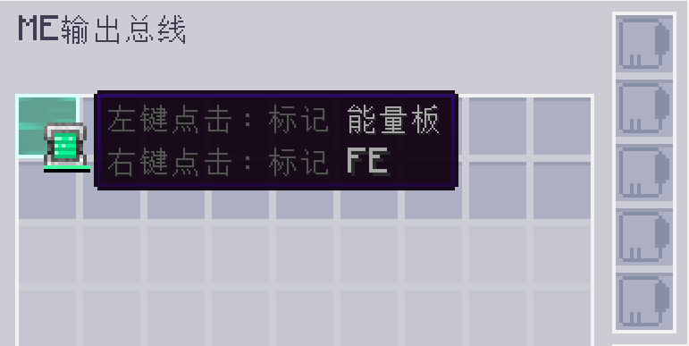

---
navigation:
  parent: appflux/appflux-index.md
  title: 标记FE
categories:
- flux tricks
---

# 如何在配置槽位中标记 FE

你可能想用 <ItemLink id="ae2:export_bus"/> 输出能量，而你需要在它的配置槽位中标记 FE。

右键点击带有能量容器的槽位以标记为 FE。

