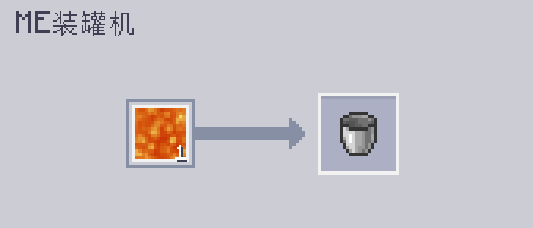

---
navigation:
  parent: epp_intro/epp_intro-index.md
  title: ME装罐器
  icon: extendedae:caner
categories:
- extended devices
item_ids:
- extendedae:caner
---

# ME装罐器

<BlockImage id="extendedae:caner" scale="8"></BlockImage>

ME装罐器是一台可将各种东西“装罐”的机器，包括流体、Mekanism 气体、Botania 魔力，甚至能量！

第一个槽位用于放入要填充的内容物，第二个槽位用于放入要被填充的容器。

它运行时需要能量，并且每次操作消耗 80 AE。

默认情况下它只能填充流体，你需要安装相应的附属模组才能让它填充其他东西。

### 支持的附属：
- 应用通量
- 应用能源：通用机械附属
- 应用能源：植物魔法附属

## 使用 ME装罐器进行自动合成

只有顶部和底部两个面可以接收能量并连接到网络。

<GameScene zoom="6" background="transparent">
  <ImportStructure src="../structure/caner_example.snbt"></ImportStructure>
</GameScene>

这是一个适用于 ME装罐器 的简单搭建。ME装罐器在从 <ItemLink id="ae2:pattern_provider" /> 接受原料后，会自动弹出已填充的物品。

<GameScene zoom="6" background="transparent">
  <ImportStructure src="../structure/caner_auto.snbt"></ImportStructure>
</GameScene>

样板中只能包含要填充的内容物和要被填充的容器。以下是一些示例：

装满水桶：

强化能量板（需要安装 Applied Flux）：

## 开罐

ME装罐器在空桶模式下也可以从容器中抽取内容物。你需要在样板中切换输入和输出。