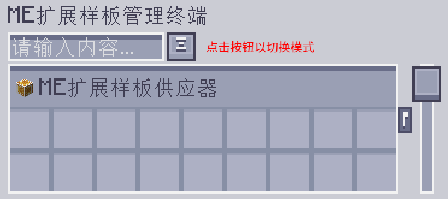
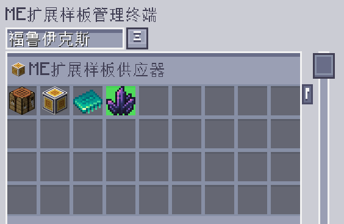
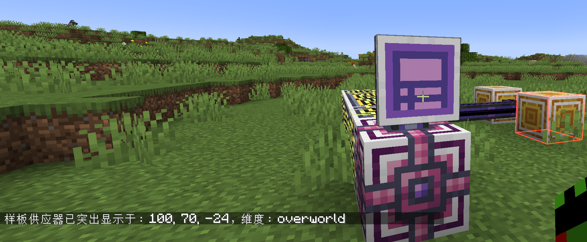

---
navigation:
  parent: epp_intro/epp_intro-index.md
  title: ME扩展样板管理终端
  icon: extendedae:ex_pattern_access_part
categories:
- extended devices
item_ids:
- extendedae:ex_pattern_access_part
- extendedae:wireless_ex_pat
---

# ME扩展样板管理终端

ME扩展样板管理终端相比 <ItemLink id="ae2:pattern_access_terminal" /> 额外提供了 3 项附加功能。

<Row gap="20">
<GameScene zoom="6" background="transparent">
<ImportStructure src="../structure/cable_ex_pattern_terminal.snbt"></ImportStructure>
<IsometricCamera yaw="180"></IsometricCamera>
</GameScene>
<ItemImage id="extendedae:wireless_ex_pat" scale="4"></ItemImage>
</Row>

## 更好的样板搜索

你可以按输入/输出材料的名称搜索样板。

## 样板高亮

有时仍然很难找到想要的样板，因为样板总是成组显示。现在，扩展
样板访问终端可以在 GUI 中高亮匹配的样板。

## 样板供应器世界高亮

在执行大型合成任务时，找出究竟是哪个样板供应器卡住了会很烦。ME扩展样板管理终端
可以高亮显示世界中的样板供应器，让你轻松定位。

