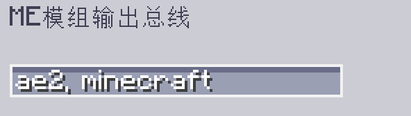

---
navigation:
  parent: epp_intro/epp_intro-index.md
  title: ME模组输出总线
  icon: extendedae:mod_export_bus
categories:
- extended devices
item_ids:
- extendedae:mod_export_bus
---

# ME模组输出总线

<GameScene zoom="8" background="transparent">
  <ImportStructure src="../structure/cable_mod_export_bus.snbt"></ImportStructure>
</GameScene>

ME模组输出总线是一个 <ItemLink id="ae2:export_bus" />，可以按模组名称或 mod id 进行过滤。

如果你想过滤多个模组，请用逗号分隔多个 mod id。

