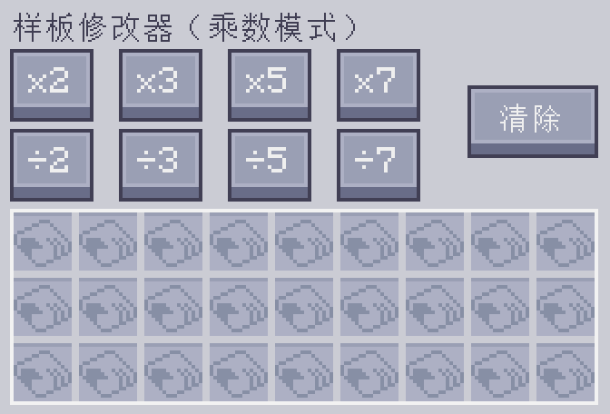
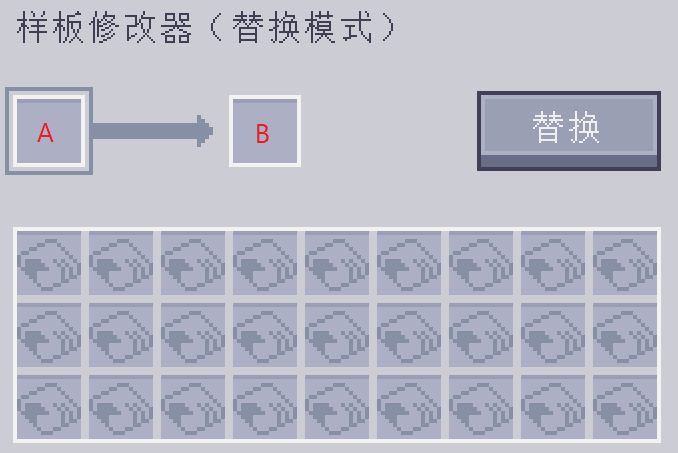
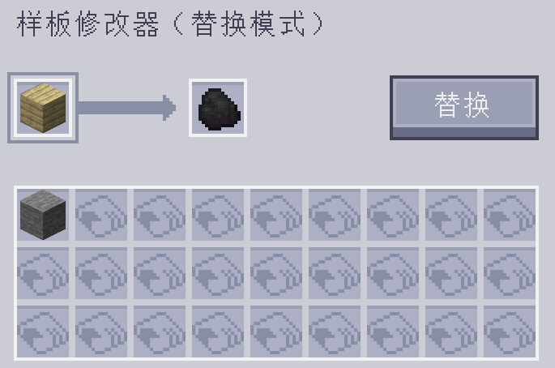
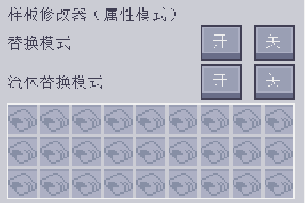
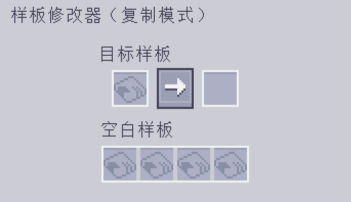

---
navigation:
  parent: epp_intro/epp_intro-index.md
  title: 样板修改器
  icon: extendedae:pattern_modifier
categories:
- extended items
item_ids:
- extendedae:pattern_modifier
---

# 样板修改器

样板修改器是一种用于批量修改样板的工具。

<ItemImage id="extendedae:pattern_modifier" scale="4"></ItemImage>

右键点击它即可打开其 GUI。

## 倍增模式

你可以通过点击对应按钮，将处理样板的输入和输出数量乘以/除以 x。 

原始样板：

×10 后：

它还可以通过点击“清除”按钮，清空所有样板中的内容并将其变为空白样板。

### 注意：

 - 除法按钮只有在数量可以整除时才会生效。例如当样板要求输入 3 个
圆石时，÷2 按钮就无法使用，因为 3÷2 = 1.5。

 - 乘法按钮有上限（999999）。它不能让单个材料的数量超过这个数。

## 替换模式

将样板中某个输入或输出材料替换为另一种物品。

A 槽位中的内容会被替换，而 B 槽位中的内容则是目标将被替换成的结果。

例如，以下设置会将木板替换为煤炭。

点击 Replace 按钮以执行替换。

## 属性模式

修改合成样板的替代和流体替换模式。

## 复制模式

在此模式下，你可以复制任意给定的样板。

