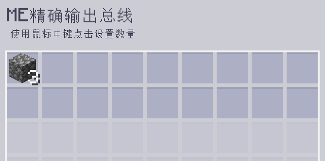
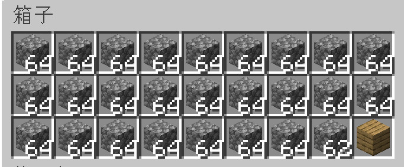

---
navigation:
  parent: epp_intro/epp_intro-index.md
  title: ME精确输出总线
  icon: extendedae:precise_export_bus
categories:
- extended devices
item_ids:
- extendedae:precise_export_bus
---

# ME精确输出总线

<GameScene zoom="8" background="transparent">
  <ImportStructure src="../structure/cable_precise_export_bus.snbt"></ImportStructure>
</GameScene>

ME精确输出总线会按指定数量导出物品/流体。只有当目标容器能够完整接收全部输出时，它才会导出。

## 示例

这意味着每次操作会导出 3 个圆石。当网络中的圆石数量低于 3 个时，它就会停止导出。

当目标容器无法容纳其导出的全部物品时，它也会停止导出。现在这个箱子只能再容纳 2 个圆石，所以输出总线会停止。