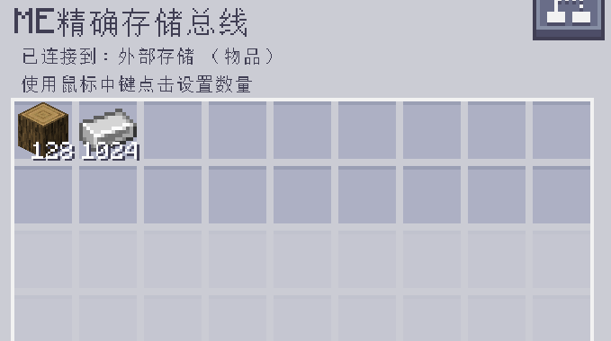

---
navigation:
  parent: epp_intro/epp_intro-index.md
  title: ME精确存储总线
  icon: extendedae:precise_storage_bus
categories:
- extended devices
item_ids:
- extendedae:precise_storage_bus
---

# ME精确存储总线

<GameScene zoom="8" background="transparent">
  <ImportStructure src="../structure/cable_precise_storage_bus.snbt"></ImportStructure>
</GameScene>

ME精确存储总线是一个 <ItemLink id="ae2:storage_bus" />，可按数量进行过滤，并且只会插入不超过该上限的物品。

