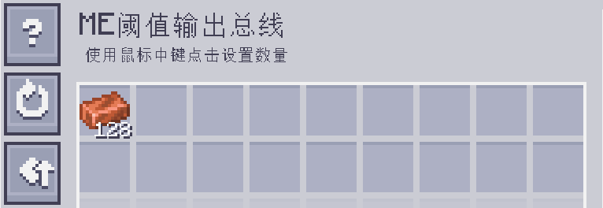
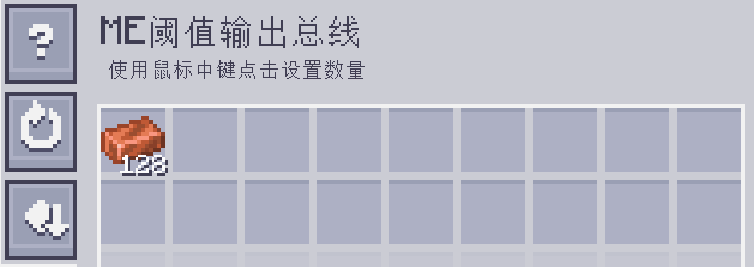

---
navigation:
  parent: epp_intro/epp_intro-index.md
  title: ME阈值输出总线
  icon: extendedae:threshold_export_bus
categories:
- extended devices
item_ids:
- extendedae:threshold_export_bus
---

# ME阈值输出总线

<GameScene zoom="8" background="transparent">
  <ImportStructure src="../structure/cable_threshold_export_bus.snbt"></ImportStructure>
</GameScene>

ME阈值输出总线会在 ME 网络中存储的某种物品数量高于/低于阈值时工作。

## 示例

铜的阈值设为 128，因此当网络中存储的铜超过 128 时，它就会导出铜。

阈值与上面相同，但模式设置为 BELOW。这样当存储的铜少于 128 时，它就会输出铜。