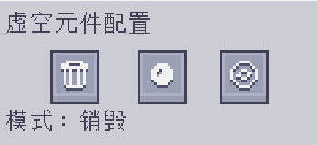

---
navigation:
  parent: epp_intro/epp_intro-index.md
  title: ME虚空元件
  icon: extendedae:void_cell
categories:
- extended items
item_ids:
- extendedae:void_cell
---

# ME虚空元件

驱动器中的一个口袋冷凝器。

<ItemImage id="extendedae:void_cell" scale="4"></ItemImage>

虚空存储元件在使用前需要在 <ItemLink id="ae2:cell_workbench" /> 上进行分区。它会删除所有
匹配其过滤器的物品，或将它们压缩为 <ItemLink id="ae2:matter_ball" /> 或 <ItemLink id="ae2:singularity" />，例如 <ItemLink id="ae2:condenser" />。

右键点击它即可打开配置 GUI。

